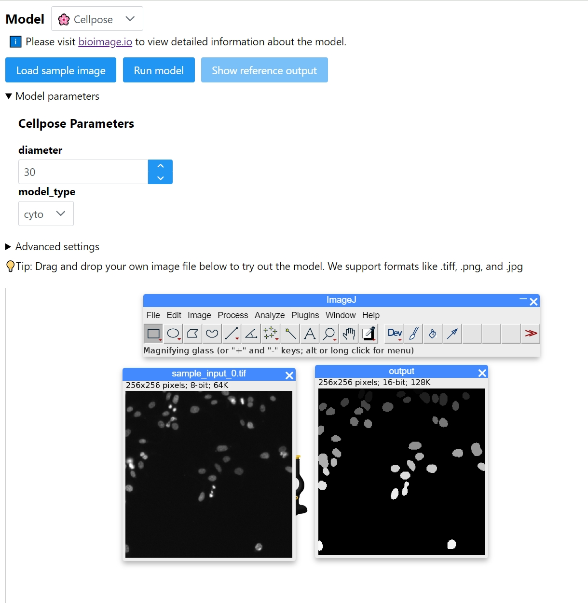

# Bioengine web client

Standalone web client for run models on Bioengine.
Directly run the advanced deep-learning models in the [bioimage.io](https://bioimage.io/#/) model zoo 🦒!

Online demo: https://bioimage-io.github.io/bioengine-web-client/



Functionality:

- Using ImageJ.js as a viewer and preprocessor.
- Loading and displaying sample input and output images for a specific model.
- Submitting images to Bioengine and displaying results.
- Image tiler allows to run model on large images.
- Export ImJoy API for using as a plugin in ImJoy.

## ImJoy API

This web client supports two-way integration with ImJoy, meaning you can either use it as an ImJoy plugin or load other ImJoy plugins into it.

The following ImJoy API is supported:

| API           | Description                                                                | Parameters                                |
| ------------- | -------------------------------------------------------------------------- | ----------------------------------------- |
| runModel      | Run model on current image(in the viewer)                                  |                                           |
| setParameters | Set model parameters                                                       | `parameters: object`                      |
| listModels    | List all models, return an array of model rdf objects                      |                                           |
| setModel      | Set the current model, support input a model_id or model name or nick name | `model: object, string`                   |
| setTiling     | Set the tile and overlap size for large images                             | `tileSizes: object; tileOverlaps: object` |
| waitForReady  | Wait for the model to be ready                                             |                                           |
| setServerUrl  | Set the server url                                                         | `url: string`                             |

Usage example:

```javascript
const client = await api.getWindow("bioengine-web-client");
console.log(await client.listModels());
// load cellpose model and run it
await client.setModel("Cellpose");
await client.setParameters({ diameter: 30, model_type: "cyto" });
await client.setTiling({ x: 64, y: 64 });
await client.runModel();
```

## Development

```bash
$ npm install -g pnpm  # install pnpm globally
$ pnpm install         # install dependencies
$ pnpm run dev         # serve with hot reload
```
